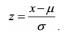

## 为什么要对数值类型的特征做归一化？
+ 量纲差异，可比性，同一数值量级。

## 两种具体方式
+ 线性函数 

+ 零均值 

## 零均值详解
+ 原始数据映射到均值为0、标准差为1的分布上。

## 等值图讲解

+ 相同学习率下，x1需要更多迭代。

## 缺点
+ 决策树不适用。 
信息增益比跟特征是否归一化无关。
+ 梯度下降求解的模型才需要 
线性回归，逻辑回归，支持向量机，神经网络等
