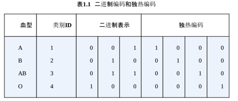

## 如何处理类别型特征？

#### 现状
+ 决策树可以直接处理字符串的输入
+ 逻辑回归，支持向量机等，需要将类别型转换为数值型。

## 具体方式 现状
+ 序号编码    ordinal Encoding 
高、中、低三档，使用高==3、中==2、低==1来表示。 
转换后依然保留了大小关系。
+ 独热编码    one-hot Encoding 
四个取值类型，A、B、C、D； 
A ==> (1,0,0,0) 
B ==> (0,1,0,0) 
C ==> (0,0,1,0) 
D ==> (0,0,0,1) 
推荐使用稀疏矩阵来表示，大部分算法均接受稀疏矩阵的输入。
+ 二进制编码  binary Encoding 
赋予一个ID 
ID变为二进制

## 图

